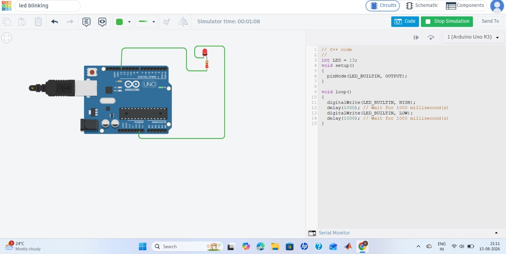

# LED-Blinking-Arduino
Basic LED Blinking project using  Arduino

## Components

- Arduino Uno
- LED
- 220Ω resistor
- Jumper wires

## Working

The Arduino controls the LED connected to digital pin 13. The LED turns ON for 1 second and OFF for 1 second continuously.

## Programming

Arduino C/C++

## Programming

Arduino C/C++

```cpp
int led = 13;

void setup() {
  pinMode(led, OUTPUT);
}

void loop() {
  digitalWrite(led, HIGH);
  delay(1000);

  digitalWrite(led, LOW);
  delay(1000);
}
## Project Image



